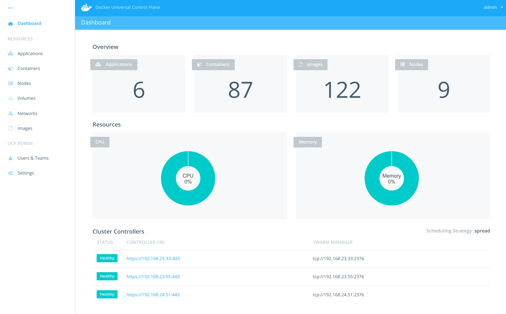
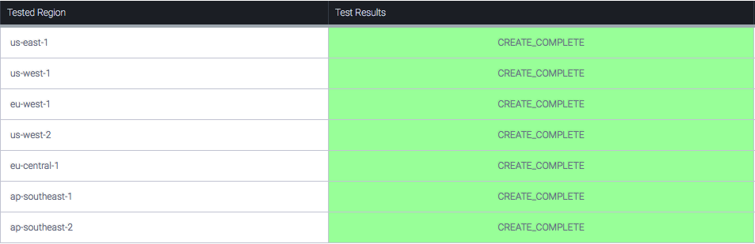

# Docker Datacenter on AWS 

### This project is not maintained anymore. The maintained version is [here](https://docs.docker.com/datacenter/install/aws/).

**TL;DR One click deploy of highly-scalable, production-ready Docker Datacenter on AWS based on Docker and AWS best-practices**




Docker Datacenter is an integrated solution including open source and commercial software, the integrations between them, full Docker API support, validated configurations and commercial support for your Docker Datacenter environment. A pluggable architecture allows flexibility in compute, networking and storage providers used in your CaaS infrastructure without disrupting the application code. Enterprises can leverage existing technology investments with Docker Datacenter. The open APIs allow Docker Datacenter CaaS to easily integrate into your existing systems like LDAP/AD, monitoring, logging and more.


Docker Data Center is composed of two main components: Docker Universal Control Plane (UCP) and Docker Trusted Registry (DTR). [UCP](https://docs.docker.com/docker-trusted-registry/overview/) is an enterprise-grade cluster management solution from Docker that helps you manage your whole cluster from a single place. UCP is made of the UCP controllers and UCP nodes. 

[DTR](https://docs.docker.com/docker-trusted-registry/overview/) is the enterprise-grade image storage solution from Docker that helps you can securely store and manage the Docker images you use in your applications. DTR is made of DTR replicas only that are deployed on UCP nodes. 

## Architecture


The AWS Cloudformation starts the installation process by creating all the required AWS resources such as the VPC, security groups, public and private subnets, internet gateways, NAT gateways, and S3 bucket. It then launches the first UCP controller instance and goes through the installation process of Docker engine and UCP containers. It backs the Root CAs created by the first UCP controllers to S3. Once the first UCP controller is up and running, the process of creating the other UCP controllers, the UCP cluster nodes, and the first DTR replica is triggered. Similar to the first UCP controller node, all other nodes are started by installing Docker Commercially Supported engine, followed by running the UCP and DTR containers to join the cluster. Three ELBs, one for UCP, one for DTR and a third for your application, are launched and automatically configured to provide resilient loadbalancing across the two AZs. Additionally, UCP controllers and nodes are launched in an ASG to provide scaling functionality if needed. This architecture ensures that both UCP and DTR instances are spread across both AZs to ensure resiliency and high-availability. UCP worker nodes are launched with `interlock` and `nginx` to dynamically register your deployed applications. 


## How to Launch Latest Release([v1.3](https://github.com/nicolaka/ddc-aws/releases/tag/v1.3))

You can launch the Cloudformation template using the AWS Console or using the AWS CLI as follows:

**1) AWS Console:**

- Click on **Launch Stack** below. This link will take you to AWS cloudformation portal.
- Confirm your AWS Region that you'd like to launch this stack in ( top right corner)
- Provide the required parameters ( listed below ) and click **Next**
- Confirm and Launch.
- Once all done ( it does take between 20-30 mins), click on outputs tab to see the URLs of UCP/DTR, default username and password, and jumphost info

[](https://console.aws.amazon.com/cloudformation/home?#/stacks/new?stackName=DockerDatacenter&templateURL=https://s3-us-west-2.amazonaws.com/ddc-on-aws-public/ddc_on_aws.json)


**2) AWS CLI:**


- Upload your Docker Datacenter license to an S3 bucket.
- Run the following Docker container from your local or dev environment:

```
docker run --env AWS_ACCESS_KEY_ID=<AWS_ACCESS_KEY_ID> \
--env AWS_SECRET_ACCESS_KEY=<AWS_SECRET_ACCESS_KEY> \
--env AWS_DEFAULT_REGION=<AWS_REGION> \
garland/aws-cli-docker aws cloudformation create-stack \
--stack-name <STACK_NAME> \
--capabilities CAPABILITY_IAM \
--template-url https://s3-us-west-2.amazonaws.com/ddc-on-aws-public/ddc_on_aws.json \
--parameters \
ParameterKey=KeyName,ParameterValue=<SSH_KEY_NAME> \
ParameterKey=RootVolumeSize,ParameterValue=<ROOT_VOLUME_SIZE> \
ParameterKey=UCPFQDN,ParameterValue=<UCP_FQDN> \
ParameterKey=UCPControllersInstanceType,ParameterValue=<INSTANCE_TYPE> \
ParameterKey=DTRInstanceType,ParameterValue=<INSTANCE_TYPE> \
ParameterKey=UCPNodesInstanceType,ParameterValue=<INSTANCE_TYPE> \
ParameterKey=ClusterSize,ParameterValue=<CLUSTER_SIZE> \
ParameterKey=License,ParameterValue=<YOUR_DDC_LICENSE_S3_URL>
```

- Once all done ( it does take between 20-30 mins), you can get stack outputs such as UCP and DTR URLs directly from CLI as follows:


```
docker run --env AWS_ACCESS_KEY_ID=<AWS_ACCESS_KEY_ID> \
--env AWS_SECRET_ACCESS_KEY=<AWS_SECRET_ACCESS_KEY> \
--env AWS_DEFAULT_REGION=<AWS_REGION> \
garland/aws-cli-docker aws cloudformation describe-stacks --stack-name <STACK_NAME>
```

- Full documentation for using `aws-cli` can be found [here](http://docs.aws.amazon.com/cli/latest/reference/cloudformation/).


**Required Paramters**

- **KeyName**: Name of an existing EC2 KeyPair to enable SSH access to the instances
- **UCPFQDN**: Intended FQDN for UCP used to self-sign a cert with domain name. 
- **UCPControllersInstanceType**: AWS EC2 Instance Type for UCP Controllers only. Minimum required is **m3.medium**
- **DTRInstanceType**: AWS EC2 Instance Type for DTR Replicas Only. Minimum required is **m3.medium**
- **UCPNodesInstanceType**: AWS EC2 Instance Type for UCP nodes
- **ClusterSize**: Number of UCP nodes (3-64)
- **License**: Docker Datacenter License (copy+past it in JSON format or URL to download it). You can easily get trial license [here](https://store.docker.com/bundles/docker-datacenter)
- **RootVolumeSize**: Root filesystem size in GB. This will be used for all instances ( UCP Controllers, UCP Nodes, and DTR Nodes)

**Key Functionalities**

- Create a New VPC, Private and Public Subnets in different AZs, ELBs, NAT Gateways, Internet Gateways, AutoScaling Groups- all based on AWS best practices
- Creates and configures an S3 bucket for DDC to be used for cert backup and DTR image storage
- Deploys 3 UCP Controllers across multiple AZs  within your VPC
- Creates a UCP ELB with preconfigured HTTP healthchecks
- Deploys a scalable cluster of UCP nodes
- Backs up UCP Root CAs to S3
- Create a 3 DTR Replicas across multiple AZs within your VPC
- Creates a DTR with preconfigured healthchecks
- Creates a jumphost ec2 instance to be able to ssh to the DDC nodes
- Creates a UCP Nodes ELB with preconfigured healthchecks (TCP Port 80). This can be used for your application that are deployed on UCP. 
- Deploys NGINX+Interlock to dynamically register your application containers. Please see FAQ for more details on launching your application. 
- Creates a Cloudwatch Log Group (called `DDCLogGroup`)and allows log streams from DDC instances. It also automatically logs the UCP and DTR installation containers. 

**Software Versions**

- EC2 instances use Ubuntu 14.04 LTS AMI
- Docker Commercially Supported Engine 1.12
- UCP 1.1.4
- DTR 2.0.3

**Notes and Caveats**

- UCP and DTR default username and password are `admin/ddconaws`. **PLEASE CHANGE PASSWORD in UCP portal!!**. To change the password, go to the UCP portal, under `Users and Teams`, click on edit button for the `admin` user. From there you can update the admin account password.
- External Certs: Both UCP and DTR are installed with self-signed certs today. If you wish to use your own certs, you can do so by following the UCP and DTR configuration guides. Full UCP and DTR Configuration guides are found [here](https://docs.docker.com/ucp/configuration/use-externally-signed-certs/) and [here](https://docs.docker.com/docker-trusted-registry/configure/configuration/).
-  A Single Security Group is used in this setup. The security group only allows HTTP,HTTPS, and SSH traffic from external IPs. Security group doesn't limit any traffic from within the cluster. Please adjust it as needed. 
- SSH: If you need to SSH into the cluster you can do so by using [SSH agent forwarding](https://developer.github.com/guides/using-ssh-agent-forwarding/) and ssh'ing into the jumphost node using the selected private key. Once you're logged into the jumphost, you can use the private IP address of any of the other nodes to ssh into them. 
- Default username for `ubuntu` based AMI's is `ubuntu`.
- Supported AWS Regions: 
	- us-east-1
	- us-west-2
	- us-west-1
	- eu-west-1
	- eu-central-1 
	- ap-northeast-1
	- ap-southeast-1
	- ap-southeast-2
	- ap-south-1

## FAQ

- **My AWS Cloudformation is failing to launch. How should I do ?**

1. Open an issue in this repo after checking that it doesn't already exist.
2. Make sure you capture the stack events and parameters provided. 
3. Make sure you capture the cloudformation stack ID.
4. Open an issue with Docker Support by emailing support@docker.com
5. If you know which instance is failing, ssh into the instance( via the jumphost instance) and capture the following:

```
/var/log/cloud-init-output.log
/var/lib/cloud/instance/scripts/part-001
```

- **How can I deploy my application on Docker Datacenter?**

It is easy to deploy a your Docker applications on Docker Datacenter. You can launch your applications from CLI (instruction [here](https://docs.docker.com/ucp/applications/deploy-app-cli/)) or UCP portal (instruction [here](https://docs.docker.com/ucp/applications/deploy-app-ui/)).

- **How can I access my application on Docker Datacenter?**

If you wish to access your application using a DNS name, you need to do two things:

1. Create a DNS record (A or CNAME) for your application using the APP ELB that gets created. The APP ELB load-balances traffic across all UCP worker nodes that have NGINX running which automatically get updated when you launch your application.

2. Launch your application with `interlock` labels. Note: Interlock+NGINX are already deployed as part of the Cloudformation template. 

For example, to access a Compose app using `app.example.com`, you first need to create a DNS record for it using the APP ELB's DNS name/IP then launch it with following labels:

```
app:
    image: ehazlett/docker-demo:latest
    ports:
        - 8080
    labels:
        - "interlock.hostname=app"
        - "interlock.domain=example.com"
```

More details on interlock can be found [here](https://github.com/ehazlett/interlock). 

- **How can I send container logs to Cloudwatch ?**

Run your container with the following Docker run options `--log-driver=awslogs --log-opt awslogs-group=DDCLogGroup` and you should see your container logs in AWS's Log Group. 
 
- **What's the support model for Docker Datacenter on AWS ?**

The solution provided is based on Docker and AWS best practices and therefore the Docker Dataceter components of the solution are commercially supported by Docker  while the AWS components are supported by AWS. If you are facing any issues related to launching the solution please open issues here on Github. If the issues your'e facing are related to Docker Datacenter components please contact Docker support. If the issues your'e facing are related to AWS specifically, please contact AWS support.

- **How can I obtain Docker Datacenter license?**

You can obtain trial license quickly and easily by going to [here](https://store.docker.com/bundles/docker-datacenter). If you're interested in buying Docker Datacenter subscription please contact Docker [here](https://goto.docker.com/contact-us.html).

**Version 1.3 Cloudformation Test Results**




