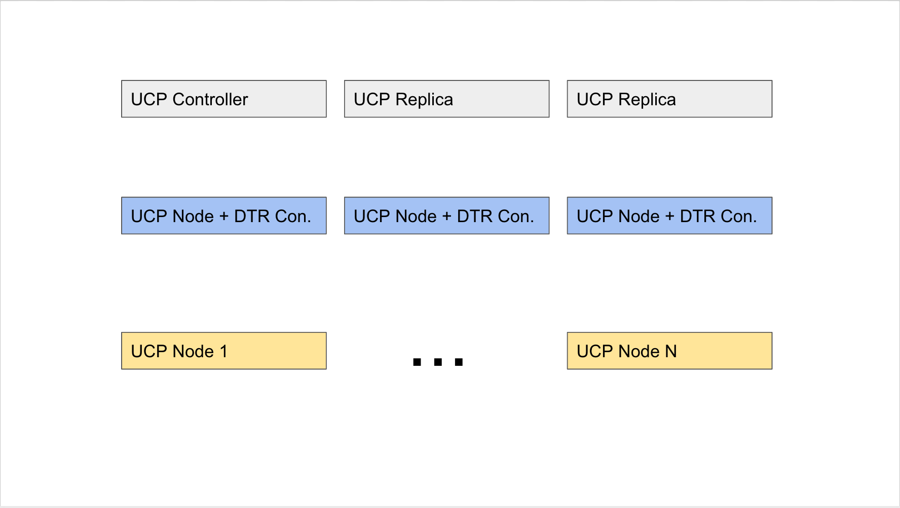

# Docker Datacenter on AWS 

Docker Data Center Design:

Docker Data Center is made of two main components: Docker Universal Control Plane (UCP) and Docker Trusted Registry (DTR). UCP is made of the UCP controllers and UCP nodes. DTR is made of DTR replicas only. UCP needs to be installed first before DTR can be installed. The following is the recommended architecure and installation workflow:



Requirements:

**AMI:**

*  Ubuntu 14.04
*  3.16+ Kernel
*  3.5 G Minimum RAM

**Setup:**

* Single VPC in Single Region
* 2 AZs with Private Subnets
* Public Subnet


**Packages:**

* Docker CS Engine 1.11+


**Standard Intallation Shell Script for all Nodes:**


```
wget -qO- https://get.docker.com/ | sh
sudo usermod -aG docker ubuntu
```

**Standard Docker daemon.json:**

```
```

**User Parameters:**

1. UCPSAN: The user defined SAN/FQDN for UCP.
2. License: the json formatted license text.
3. DTRSAN: The user defined SAN/FQDN for DTR.
4. ClusterSize: The total number of UCP node ( excluding any UCP/DTR controller nodes)
5. KeyName: Name of an existing EC2 KeyPair
6. InstanceType: EC2 Instance Type


**Installation Phases:**

1. UCP Installation: First phase is the create the UCP cluster that's composed of the three controllers (we'll call them `controller1`,`controller2`, `controller3`) and N number of nodes defined by an auto-scaling group. 

	a. Installing the first UCP Controller:

- Pass the UCPSAN user parameter as environment variable.


```
sudo docker run -v /var/run/docker.sock:/var/run/docker.sock -v /home/ubuntu/docker_subscription.lic:/docker_subscription.lic -e UCP_ADMIN_PASSWORD=ddconaws --name ucp docker/ucp:latest install -D --host-address $PRIVATE_IP --san $PRIVATE_IP --san

```

    
   b.  Install the UCP Controller #2 and #3
   
   - Curl the CA to get the SHA fingerprint and export it as an env var (UCP_FINGERPRINT)
   - Get private IP of `controller1` and pass it as env var ( export UCP_URL=https://PRIVATE_IP:443)
   - Pass the UCPSAN user parameter as environment variable(UCPSAN).

```
sudo -E docker run --rm -i --name ucp -e UCP_ADMIN_USER=admin -e UCP_ADMIN_PASSWORD=ddconaws -v /var/run/docker.sock:/var/run/docker.sock docker/ucp join  --replica  --url $UCP_URL --fingerprint $UCP_FINGERPRINT -D --san

```


c.  Install the UCP Nodes using an autoscaling group.
	
   -  Curl the CA to get the SHA fingerprint and export it as an env var (UCP_FINGERPRINT)
   -  Get private IP of `controller` and pass it as env var ( export UCP_URL=https://PRIVATE_IP:443)

```
sudo -E docker run --rm -i --name ucp -e UCP_ADMIN_USER=admin -e UCP_ADMIN_PASSWORD=ddconaws -v /var/run/docker.sock:/var/run/docker.sock docker/ucp join --url $UCP_URL --fingerprint $UCP_FINGERPRINT -D
   
```

**TODOs**:
- Version UCP : hardcode UCP version for compatibility
- ELB: Create an ELB for UCP, attach the controllers to it.
- Remove CNAME paramter.
- Create an A record for UCPSAN to be mapped to the ELB
- Root CA backup
- Potentially Autoscaling group for controllers ( need to ensure odd number though)
- DTR 2.0 Installation


