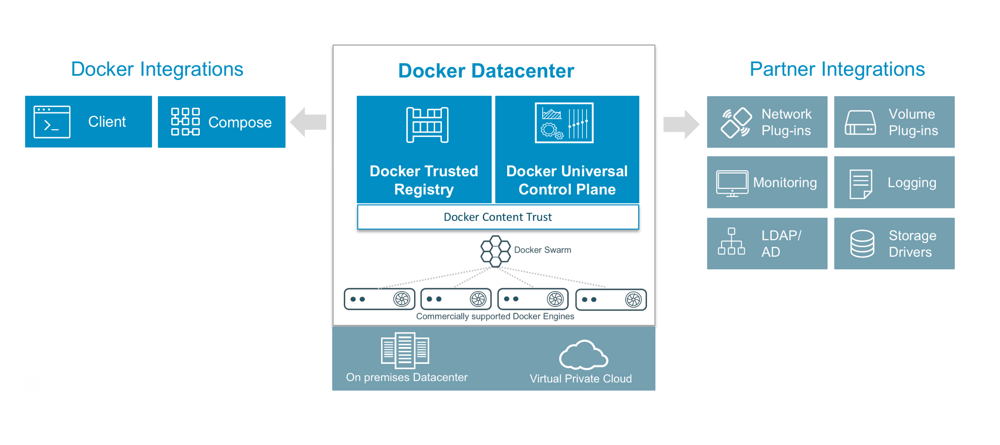
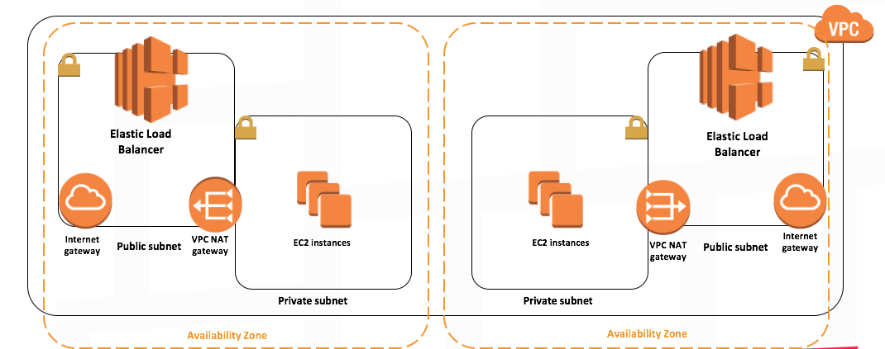

# Docker Datacenter on AWS 

**TL;DR One click deploy of highly-scalable, production-ready Docker Datacenter on AWS based on Docker and AWS best-practices**

Docker Datacenter is an integrated solution including open source and commercial software, the integrations between them, full Docker API support, validated configurations and commercial support for your Docker Datacenter environment. A pluggable architecture allows flexibility in compute, networking and storage providers used in your CaaS infrastructure without disrupting the application code. Enterprises can leverage existing technology investments with Docker Datacenter. The open APIs allow Docker Datacenter CaaS to easily integrate into your existing systems like LDAP/AD, monitoring, logging and more.

Docker Data Center is composed of two main components: Docker Universal Control Plane (UCP) and Docker Trusted Registry (DTR). [UCP](https://docs.docker.com/docker-trusted-registry/overview/) is an enterprise-grade cluster management solution from Docker that helps you manage your whole cluster from a single place. UCP is made of the UCP controllers and UCP nodes. 

[DTR](https://docs.docker.com/docker-trusted-registry/overview/) is the enterprise-grade image storage solution from Docker that helps you can securely store and manage the Docker images you use in your applications. DTR is made of DTR replicas only that are deployed on UCP nodes. 

## Architecture

The AWS Cloudformation starts the installation process by creating all the required AWS resources such as the VPC, security groups, public and private subnets, internet gateways, NAT gateways, and S3 bucket. It then launches the first UCP controller instances and goes through the installation process of Docker engine and UCP containers. It backs the Root CAs created by the first UCP controllers to S3. Once the first UCP controller is up and running, the process of creating the other UCP controllers, the UCP cluster nodes, and the first DTR replica is triggered. Similar to the first UCP controller node, all other nodes are started by installing Docker Commercially Supported engine, followed by running the UCP and DTR containers to join the cluster. Two ELBs, one for UCP and one for DTR, are launched and automatically configured to provide resilient loadbalancing across the two AZs. Additionally, UCP controllers and nodes are launched in an ASG to provide scaling functionality if needed. This architecture ensures that both UCP and DTR instances are spread across both AZs to ensure resilincy and high-availability. Route53 is used to dynamically register and configure UCP and DTR in your private or public HostedZone.

## How to Launch

- Click on **Launch Stack**. This link will take you to AWS Cloudformation portal.
- Confirm your AWS Region that you'd like to launch this stack in ( top right corner)
- Provide the required paramters ( listed below ) and click **Next**
- Confirm and Launch.
- Once all done ( it does take between 20-30 mins), click on outputs tab to see the URLs of UCP/DTR, default username, and password, and S3 bucket name.

**Required Paramters**

- **KeyName**: Name of an existing EC2 KeyPair to enable SSH access to the instances
- **HostedZone**: Route53 Public HostedZone ID to use. (e.g. Z2FDTNDATAQYW2)
- **UCPFQDN**: FQDN, including subdomain, for UCP (e.g. ucp.example.com). Must be subdomain of selected Route53 HostedZone
- **DTRFQDN**: FQDN, including subdomain, for DTR (e.g. dtr.example.com). Must be subdomain of selected Route53 HostedZone
- **UCPControllersInstanceType**: AWS EC2 Instance Type for UCP Controllers only. Minimum required is **m3.medium**
- **DTRInstanceType**: AWS EC2 Instance Type for DTR Replicats Only. Minimum required is **m3.medium**
- **UCPNodesInstanceType**: AWS EC2 Instance Type for UCP nodes
- **ClusterSize**: Number of UCP nodes (3-64)
- **License**: Docker Datacenter License (copy+past it in JSON format or URL to download it). You can easily get trial license [here](https://hub.docker.com/enterprise/trial/)

**Key Functionalities**

- Create a New VPC, Private and Public Subnets in different AZs, ELBs, NAT Gateways, Internet Gateways, AutoScaling Groups- all based on AWS best practices
- Creates an S3 bucket for DDC to be used for cert backup and DTR image storage ( requires additional configuration in DTR )
- Deployes 3 UCP Controllers across multiple AZs  within your VPC
- Creates a UCP ELB with preconfigured healthchecks
- Creates a DNS record and attaches it to UCP ELB
- Deploys a scalable cluster of UCP nodes
- Backs up UCP Root CAs to S3
- Create a 3 DTR Replicas across multiple AZs within your VPC
- Creates a DTR with preconfigured healthchecks
- Creates a DNS record and attaches it to DTR ELB

**Software Versions**

- EC2 instances use Ubuntu 14.04 LTS AMI
- Docker Commercially Supported Engine 1.11
- UCP 1.1.1
- DTR 2.0.1

**Notes and Caveats**

- UCP and DTR default username and password are `admin/ddconaws`. **PLEASE CHANGE PASSWORD in UCP portal!!**
- External Certs: Both UCP and DTR are installed with self-signed certs today. If you wish to use your own certs, you can do so by following the UCP and DTR configuration guides. Full UCP and DTR Configuration guides are found [here](https://docs.docker.com/docker-trusted-registry/overview/) and [here](https://docs.docker.com/docker-trusted-registry/configure/configuration/).
-  A Single Security Group is used in this setup. The security group only allows HTTPS traffic from external IPs. Security group doesn't limit any traffic from within the cluster. Please adjust it as needed. 
- SSH: If you need to SSH into the cluster you need to edit the security group setting to allow TCP port 22. Additionally, since all the instances are not part of any public subnet, you need to launch a  separate jumphost on the public subnet and use it to ssh into any of the EC2 instances.
- Default username for `ubuntu` based AMI's is `ubuntu`.
- Supported AWS Reqgions: 
	- us-east-1
	- us-west-2
	- us-west-1
	- eu-west-1
	- eu-central-1 
	- ap-northeast-1
	- ap-southeast-1
	- ap-southeast-2

## FAQ

- **What's the support model for Docker Datacenter on AWS ?**

The solution provided is based on Docker and AWS best practices and therefore the Docker Dataceter components of the solution are commercially supported by Docker  while the AWS components are supported by AWS. If you are facing any issues related to launching the solution please open issues here on Github. If the issues your'e facing are related to Docker Datacenter components please contact Docker support. If the issues your'e facing are related to AWS specifically, please contact AWS support.

- **How can I obtain Docker Datacenter license?**

You can obratin trial license quickly and easily by going to [here](https://hub.docker.com/enterprise/trial/). If you're interested in buying Docker Datacenter subscription please contact Docker [here](https://goto.docker.com/contact-us.html).

